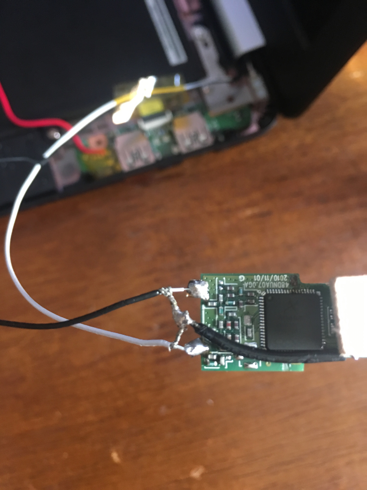
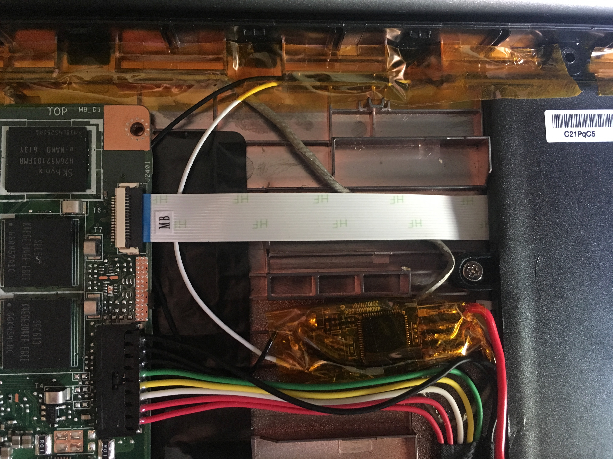

# AsusC201-usb-wifi-from-webcam

## Why
* Add a usb wifi dongle without losing a usb port, or dealing with a dongle plugged in all the time
* Replace the useless webcam with usb wifi that respects your freedom (ath9k_htc)

## Requirements

* Soldering Iron
* Wifi USB dongle that is supported by the ath9k_htc open source driver
  * I used https://www.thinkpenguin.com/gnu-linux/penguin-wireless-n-usb-adapter-gnu-linux-tpe-n150usb but many different ones have the same chipset
  * For example, the ONKYO UWF-1 (Not ONKYO UWF-1 B  !!!!) seems to be the original manufacturer version of the one I linked above
* Some form of electrical tape (preferably the plastic-y clear yellow stuff)
* a short piece of wire

## Instructions

Opened up the c201 following this guide until you have the frame around the lcd removed: https://www.ifixit.com/Guide/Asus+Chromebook+C201+LCD+Screen+Replacement/60771
Unplug and pry out the glued in webcam module. 

Peeling away the adhesive, you can see the designers printed the pinout on the module!

Well, sort of. 

Using the test pads behind a piece of tape near the connector I found the pinout to be:
 

* Pin 1: Black: 3v3
* Pin 2: Red: D-
* Pin 3: Brown:  D+
* Pin 4: Orange:  GND
* Pin 5: Purple:  GND

and the rest are unconnected.

When I originally did this project, I had used the 3.3v red wire to power the usb dongle. I have since realized this was a bad choice as I believe the dongle was resetting
due to a lack of power. 

I found a good source of 5v on the usb board, and ran a wire so that it would avoid pushing up the heatsink which still allowing the topcase to be reinstalled correctly and without any buldging.

For pictures of how the 5v wire was ran under the cover look below at antenna upgrade. 

So now, I chopped off the webcam connector and soldered Red, Brown, and Orange to a spare usb port and tested it out with a flash drive I don't care about:

It works!

Now to find a place to stuff the guts of the dongle.

The most space can be found under the "heatsink" / keyboard reinforcement right by where the battery wire run. 
The dongle I bought fit perfectly after taping the wires in a bundle(sorry for the blurry pics, clearer ones below)

Running the webcam cable back along the display cable, soldering it to the wifi dongle, and taping the wire down in places so it won't get pinched by the keycoard/topcase

Once I built the firmware and installed it, it worked perfectly. 

Oh, and I left the now even more useless webcam with the chopped off connector plugged into it back where it belongs for safekeeping.

My Asus c201 now can run open source software from the BIOS (libreboot) to the OS (debian or devuan) to the wifi card. And no intel ME to do unknown things! ;) 

## Antenna Upgrade

When I went in to fix the power issue I also removed the small wifi dongles antennas and soldered on the antenna built into the lcd housing.

The antenna are the two bent metal pieces. I believe the larger one is the the main antenna while the smaller is the secondary. 

From the little I know about antenna, there must be a feed or source and a ground. Using a multimeter, I found that the back through-hole connection of each antenna
was likely the feed, so I desoldered the other ground connections and trimmed off the rest of the antenna

Now to prep the antenna cables. The cables are just small coax cables, meaning they have a core and a sheath where the core connects to the feed and the sheath connects to ground.
This is most apparent on the black cable:

As these cables are very very small and have two layers they are very difficult to strip, so be careful.

It seems that usually the white cable is the main antenna and the black is secondary so I soldered them accordingly. 

I had to run a short piece of wire from the ground trace on the usb connector as the leftover ground pads from the antenna were very small and hard to solder to.

As for cable management, its a bit easier than before as the wifi dongle is now thinner without the metal antenna. I ran the 5v power wire along side the batter and battery wires,
so that it sits below the heatsink. 

With the topcase/keyboard back on it looks just like a stock c201, despite being a little ugly on the inside 

If you want a distribution of GNU/Linux that respects your freedom, and is made to support the c201 specifically check out my other project
https://github.com/SolidHal/PrawnOS

Firmware build instructions: https://wiki.debian.org/ath9k_htc/open_firmware

Hackaday project with similar webcam: https://hackaday.io/project/3400-toshiba-8071a2gb-webcam-module
